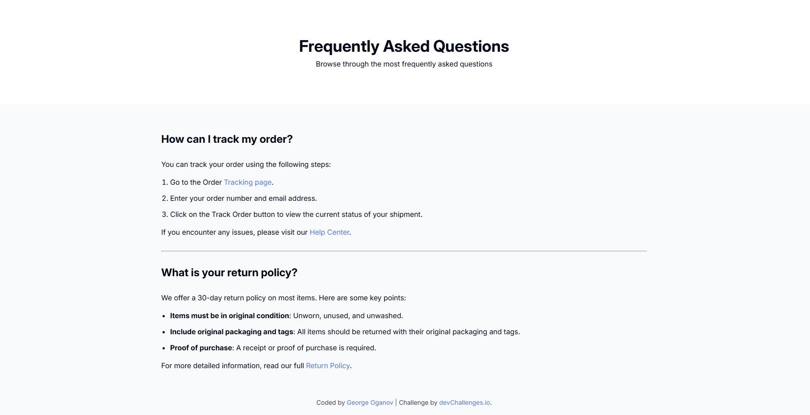

<h1 align="center">Simple FAQ | devChallenges</h1>

   Solution for a challenge <a href="https://devchallenges.io/challenge/simple-faq-challenge" target="_blank">Simple FAQ</a> from <a href="http://devchallenges.io" target="_blank">devChallenges.io</a>.

  <h3>
    <a href="https://oganov2001.github.io/simple-faq/">
      Demo
    </a>
     | 
    <a href="https://github.com/Oganov2001/simple-faq">
      Solution
    </a>
     | 
    <a href="https://devchallenges.io/challenge/simple-faq-challenge">
      Challenge
    </a>
  </h3>

## Table of Contents

- [Overview](#overview)
  - [What I learned](#what-i-learned)
  - [Useful resources](#useful-resources)
- [Built with](#built-with)
- [Features](#features)
- [Contact](#contact)
- [Acknowledgements](#acknowledgements)

## Overview

### What I learned

I learned greatly about web design while building it.

### Useful resources

[Google Fonts](https://fonts.google.com/) - This helped me get the 'Inter' font.
[W3Schools](https://www.w3schools.com/) - Learned a lot about media queries there.

### Built with

- Vanilla HTML
- Vanilla CSS

## Features

This application/site was created as a submission to a [DevChallenges](https://devchallenges.io/challenges-dashboard) challenge.

## Author

- GitHub [@Oganov2001](https://{github.com/Oganov2001})
